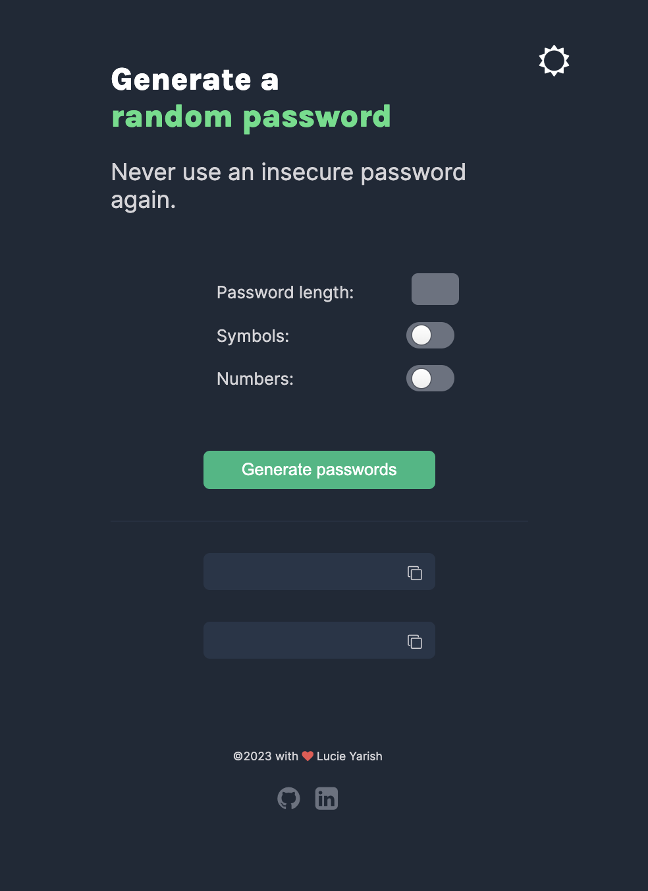

# Password Generator

This solo project was build entirely by me while learning JavaScript basics through Scrimba's Frontend Career Path courses. Figma design was provided by Scrimba and later on adjusted by me.

You can view the finished project on [Netlify](https://password-generator-lucieyarish.netlify.app/)!

Basic requirements for this project were to:

- Generate 2 passwords when user clicks the button
- Make each password 15 characters long

Optional stretch goals assigned by Scrimba:

- 'Copy-to-clipboard' functionality
- Ability to set desired password length
- Give users option to choose whether they want passwords to contain symbols and/or numbers in addition to letters

Stretch goals added by me:

- Add password length restriction
- Ability to switch between dark and light mode
- Notify user about exceeding length restriction
- Notify user that password was successfully copied
- Try to make app responsive
- Deploy to Netlify

Unfortunately, I did not follow mobile-first approach from the beginning, and therefore, the app has many limitations when it comes to its layout on different devices. The styles are rather messy, but since the project was built in order to practice mainly JavaScript, I've decided to not try making it perfect at the moment. Instead, I'm going to focus on moving on with the frontend career path course as I'll be learning more about responsive design and relative units in the upcoming lessons.

Although the app is not fully responsive and doesn't look great on all devices, I am still quite happy with the result. This is the first bigger project I built solely with HTML, CSS and JS, and all the functionalities are working as expected.

Total dev time: 17 hours

(A fairly big amount of time was spent on attempts in making the app fully responsive and, consequently, creating a lot of CSS mess.)
